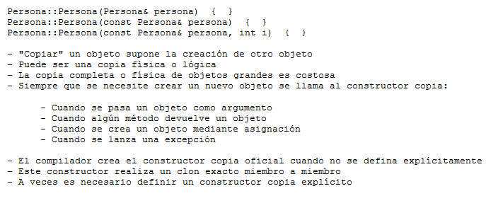

.. -*- coding: utf-8 -*-

.. _rcs_subversion:

Clase 04 - PGE 2018
===================
(Fecha: 27 de agosto)

**Copiar objetos**

.. figure:: images/clase04/copiar_objetos.png

**Constructor copia**

**Operador de asignación**

.. figure:: images/clase04/operador_asignacion.png

Ejercicio 4:
============

- Definir la clase LineaDeTexto que herede de QLineEdit
- Sobrecargar el operator+ operator= y el contructor copia para que se puede ejecutar la siguiente línea de código:
	
.. code-block:: c
	
	linea = linea1 + linea2;  
	// Los tres son objetos LineaDeTexto y la suma devuelve un LineaDeTexto que tiene los textos concatenados
	
MiniExamen de preguntas múltiples
=================================

:Tarea para Clase 5:
	Completar y estudiar exhaustivamente la clase Listado

	Estudiar sobrecarga de operadores y templates

	Ver `Tutorial Qt QVector <https://www.youtube.com/watch?v=Z9u2yDPh57U>`_ de `Videos tutoriales de Qt <https://www.youtube.com/playlist?list=PL54fdmMKYUJvn4dAvziRopztp47tBRNum>`_

	Ver `Tutorial Qt QList <https://www.youtube.com/watch?v=xx5wIjUwlg8>`_ de `Videos tutoriales de Qt <https://www.youtube.com/playlist?list=PL54fdmMKYUJvn4dAvziRopztp47tBRNum>`_

	Ver `Tutorial C++ vector <https://www.youtube.com/watch?v=dNb468_AJQI>`_ de `Videos tutoriales de C++ <https://www.youtube.com/playlist?list=PL54fdmMKYUJvS32aLptKVC0AH9bwsavzi>`_

