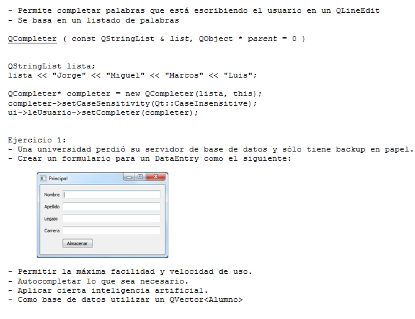

.. -*- coding: utf-8 -*-

.. _rcs_subversion:

Clase 07 - PGE 2018
===================
(Fecha: 6 de septiembre)

Clase QCompleter
================

Ejercicio 7:
============

- Hacer lo mismo pero la base de datos que sea un archivo SQLite.

Ejercicio 8:
============

- Definir una clase genérica Vector que herede de QVector.
- Modificar el comportamiento de los siguientes métodos:
	- at() - En vez de obtener el primer elemento con 0 que lo haga con 1, el 1 con 2,...
	- size() - Bloquearlo, que no se pueda usar.
	- float getPromedio() - Si los elementos son int o float, devolver el promedio sino devolver -1

**Clase QTreeWidget**

- Permite visualizar una vista en árbol
- Maneja ítems (objetos de la clase QTreeWidgetItem)

.. code-block::

    QTreeWidget *treeWidget = new QTreeWidget;
    treeWidget->setColumnCount(2);
    QList<QTreeWidgetItem *> items;

    QStringList campos;
    campos << "Campo 1" << "Campo 2";

    for (int i = 0; i < 5; ++i)
       items.append(new QTreeWidgetItem(campos));
 
    treeWidget->addTopLevelItems(items);
    treeWidget->show();

