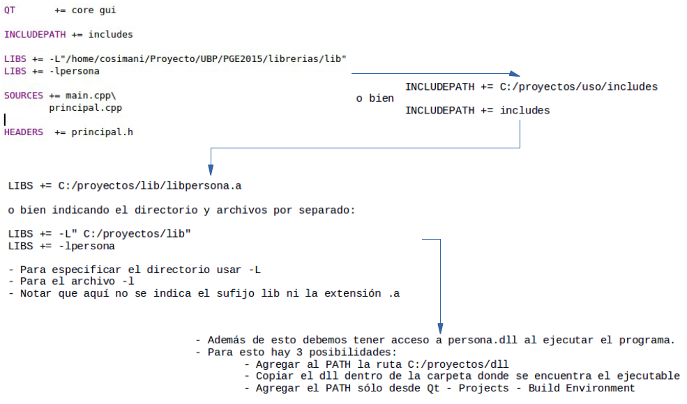

.. -*- coding: utf-8 -*-

.. _rcs_subversion:

Clase 08 - PGE 2017 (Clase no preparada aún)
===================
(Fecha: 6 de septiembre)

**Creación y uso de librerías dinámicas**

.. figure:: images/clase08/librerias.png

.. figure:: images/clase08/librerias01.png

.. figure:: images/clase08/librerias02.png

**Ejercicio**
	- Utilizar la clase LineaDeTexto.
	- Con todas las carecterísticas que hemos ido agregando (las sugerencias, los operadores, etc.)
	- Crear una librería dinámica con esta clase.
	- Usar esta librería en otro proyecto para probar su funcionamiento.

Uso de una clase propia con QtDesigner
======================================

- Deben heredar de algún QWidget
- Colocamos el widget (clase base) con QtDesigner
- Clic derecho "Promote to"

.. figure:: images/clase07/qtdesigner.png
					 
- Base class name: QLabel
- Promoted class name: MiLabel
- Header file: miLabel.h
- Add (y con esto queda disponible para promover)

- La clase MiLabel deberá heredar de QLabel
- El constructor debe tener como parámetro:

.. code-block::

	MiLabel(QWidget *parent = 0);  // Esto en miLabel.h

	MiLabel::MiLabel(QWidget *parent) : QLabel(parent)  {  // Esto en miLabel.cpp
	
	}

Ejercicio 12:
============

- Definir la clase TuLabel que herede de QLabel
- Agregar un QLabel a la GUI y promoverlo a TuLabel
- Agregar un método void cambiarTexto(QString nuevoTexto)
- Usar ese método desde la clase Principal de la siguiente forma:

.. code-block::

	ui->tuLabel->cambiarTexto("Sos un TuLabel?");

**Ejercicio**
	- En una nueva aplicación utilizar la clase LineaDeTexto con la característica de sugerencias
	- Diseñar la GUI con QtDesigner usando QLineEdit y promoverlo a LineaDeTexto

MiniExamen de preguntas múltiples
=================================

:Tarea para Clase 9:
	Completar y estudiar exhaustivamente operador de asignación y constructor copia

	Estudiar eventFilter y LineaDeTexto mejorado

	Ver `Tutorial Qt Creator - qDebug Operador de inserción <https://www.youtube.com/watch?v=IBMU3FyisKY>`_ de `Videos tutoriales de Qt <https://www.youtube.com/playlist?list=PL54fdmMKYUJvn4dAvziRopztp47tBRNum>`_

	Ver `Tutorial Qt Creator - Timer <https://www.youtube.com/watch?v=_Ps7aHDoAr4>`_ de `Videos tutoriales de Qt <https://www.youtube.com/playlist?list=PL54fdmMKYUJvn4dAvziRopztp47tBRNum>`_

	Ver `Tutorial Qt Creator - QTimer <https://www.youtube.com/watch?v=c6JZECBL54Q>`_ de `Videos tutoriales de Qt <https://www.youtube.com/playlist?list=PL54fdmMKYUJvn4dAvziRopztp47tBRNum>`_

	Ver `Tutorial Qt Creator - Archivo de recursos <https://www.youtube.com/watch?v=u8xKE0zHLsE>`_ de `Videos tutoriales de Qt <https://www.youtube.com/playlist?list=PL54fdmMKYUJvn4dAvziRopztp47tBRNum>`_

