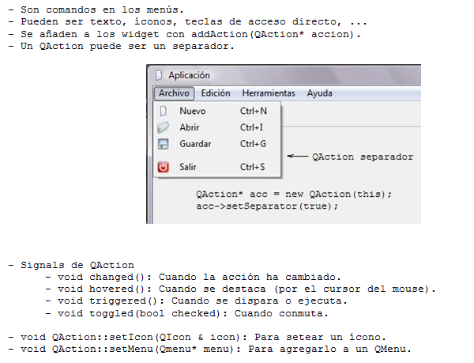

.. -*- coding: utf-8 -*-

.. _rcs_subversion:

Clase 09 - PGE 2017 (Clase no preparada aún)
===================
(Fecha: 12 de septiembre)

**QMainWindow**

.. figure:: images/clase08/qmainwindow.png

**QAction**

**QIcon**

.. figure:: images/clase08/qicon.png

:Buscar íconos aquí: http://findicons.com/

Ejercicio 13:
============

- Editor de  código fuente C++

.. figure:: images/clase08/ejercicio.png

