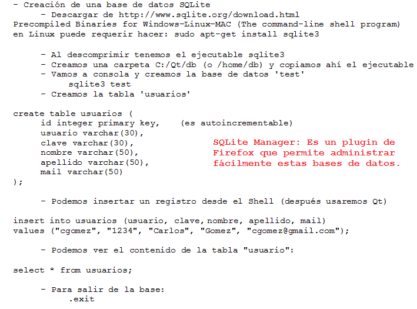
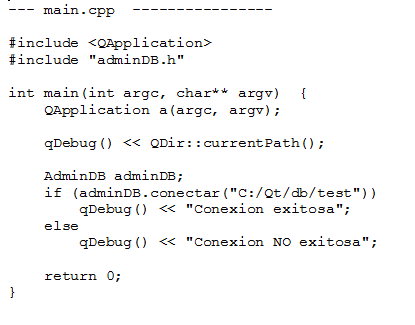

.. -*- coding: utf-8 -*-

.. _rcs_subversion:

Clase 12 - PGE 2017 (Clase no preparada aún)
===================
(Fecha: 27 de septiembre)

Utilización de cámaras de video con Qt
======================================

- Clase QCamera: Controlador de las cámaras
- Clase QCameraViewfinder: Es un QWidget visualizador de imágenes de la cámara
- Clase QCameraInfo: Listado de las cámaras disponibles y la info de cada una
- Requiere en el .pro: QT += multimedia multimediawidgets #Qt5.3 mínimo

**Publicar la descripción de las cámaras disponibles**

.. code-block::

	QList<QCameraInfo> cameras = QCameraInfo::availableCameras();
	for (int i=0 ; i<cameras.size() ; i++)  
	    qDebug() << cameras.at(i).description();

**Instanciar QCamera y mostrar los frames sobre el QCameraViewfinder**

.. code-block::

    QCameraInfo cameraInfo = cameras.at(0);
    QCamera * camera = new QCamera(cameraInfo);

    QCameraViewfinder *visor = new QCameraViewfinder;

    camera->setViewfinder(visor);
    camera->start();

    visor->show();

**Creación de un visor promovido a QWidget para QtDesigner**

.. code-block::

	// Puede estar sólo en el .h (en visor.h)
	#ifndef VISOR_H
	#define VISOR_H

	#include <QCameraViewfinder>

	class Visor : public QCameraViewfinder  {
	    Q_OBJECT
	public:
	    explicit Visor(QWidget *parent = 0 ) : QCameraViewfinder(parent)  {   }
	};

	#endif // VISOR_H

**Ejercicio**

- Crear una aplicación con un QCameraViewfinder promovido a QWidget en QtDesigner
- Un botón "Mostrar imagen" para que encienda la cámara y muestre la imagen
- Que complete un QComboBox con las cámaras disponibles
- Un QPushButton para iniciar la cámara seleccionada

**Resolución**

:Código fuente: https://github.com/cosimani/Curso-PGE-2015/tree/master/sources/clase10/camera

Ejercicio 15:
============

- Siguiendo el ejercicio anterior, crear una carpeta donde se irán guardando las imágenes de la cámara
- Colocar un QSlider con rango entre 500 y 5000, paso de 500, que indica un cantidad en mili segundos
- Descargar en disco las imágenes en archivos jpg cada un tiempo en mseg según el QSlider
- El nombre del archivo tendrá la fecha y hora en que fue capturada.

Ejercicio 16:
============

- Siguiendo el ejercicio anterior, usar todas las imágenes de esa carpeta mostrándolas en un QWidget cada 100 mseg.

Base de datos con SQLite (repaso)
========================

.. figure:: images/clase09/sqlite1.png

.. figure:: images/clase09/sqlite3.png

**Ejercicio**

.. figure:: images/clase09/ejercicio4.png

.. figure:: images/clase09/ejercicio4a.png

**Para independizar del SO**

.. figure:: images/clase09/independizar.png

**Consulta a la base de datos**

.. figure:: images/clase09/consultar1.png

.. figure:: images/clase09/consultar2.png

**Análisis píxel a píxel**

- **Ejemplo:** Dejar sólo el componente rojo

.. code-block::

    QPixmap pixMap = ui->visor->grab();  // Para llevar el QWidget a QImage
    QImage image = pixMap.toImage();

    for (int x=0 ; x<image.width() ; x++)  {
        for (int y=0 ; y<image.height() ; y++)  {
            QRgb rgb = image.pixel(x, y);  // typedef unsigned int QRgb;
            QRgb nuevoValorRgb = qRgb(qRed(rgb), 0, 0);
            image.setPixel(x, y, nuevoValorRgb);
        }
    }

Ejercicio 17:
============

- Agregar un QPushButton "Capturar imagen" para procesarla
- Dibujar con paintEvent esa imagen procesada 
- Procesar la imagen con lo siguiente:
	- Invertir los colores rgb a bgr
	- Transformar a escala de grises
		Y = 0.3 R + 0.3 G + 0.3 B // Y en cada componente
	- Convertir al negativo: Cada componente, si lo leemos en binario, debemos invertir cada bit.
		- Ejemplo: R=144=10010000 -> R=01101111

Levantar frame por frame: Clase QAbstractVideoSurface
=====================================================

- QAbstractVideoSurface es una clase abstracta
- Proporciona streaming de video a través de la función virtual pura present()

.. code-block:: c++

	bool QAbstractVideoSurface::present ( const QVideoFrame & frame ) [pure virtual]

**Clase Capturador para obtener los frames de la cámara**

.. code-block:: c++

	class Capturador : public QAbstractVideoSurface  {
		Q_OBJECT

	public:
		Capturador(QObject *parent = 0);

		QList<QVideoFrame::PixelFormat> supportedPixelFormats(
				QAbstractVideoBuffer::HandleType handleType = QAbstractVideoBuffer::NoHandle) const;

		bool present(const QVideoFrame &frame);

		QVideoFrame getFrameActual()  {  return frameActual;  }

	private:
		QVideoFrame frameActual;
	};

- QVideoFrame encapsula los datos de video (bits, ancho, alto, etc.)
- Para acceder a los bits es necesario mapearlo con el método map()
- El mapeo deja en memoria los datos para se accedidos.

.. code-block:: c++

	bool Capturador::present(const QVideoFrame &frame)  {
		frameActual = frame;
		
		frameActual.map(QAbstractVideoBuffer::ReadOnly);
		
		return true;  // Con la idea de devolver true si este frame fue usado
	}

- La función virtual pura supportedPixelFormats() devuelve un listado de formatos soportados.

.. code-block:: c++

	QList<QVideoFrame::PixelFormat> 
	Capturador::supportedPixelFormats(QAbstractVideoBuffer::HandleType handleType) const  {
	
		if (handleType == QAbstractVideoBuffer::NoHandle) {
			return QList<QVideoFrame::PixelFormat>()
					<< QVideoFrame::Format_RGB32
					<< QVideoFrame::Format_ARGB32;
		} else {
			return QList<QVideoFrame::PixelFormat>();
		}
	}

**El constructor**

.. code-block:: c++

	Capturador::Capturador(QObject *parent) : QAbstractVideoSurface(parent)  {

	}

Ejercicio 18:
============

- Usar Capturador para levantar las imágnes de la cámara.
- Convertir a escala de grises y visualizarlo en pantalla.

Ejercicio 19:
============

.. figure:: images/clase11/ejer2.png

Ejercicio 20:
============

.. figure:: images/clase11/ejer3.png

Ejercicio 21:
============

.. figure:: images/clase11/ejer4.png

MiniExamen de preguntas múltiples
=================================

:Tarea para Clase 12:
	Completar y estudiar exhaustivamente operador de asignación y constructor copia

	Estudiar eventFilter y LineaDeTexto mejorado

	Ver `Tutorial Qt Creator - qDebug Operador de inserción <https://www.youtube.com/watch?v=IBMU3FyisKY>`_ de `Videos tutoriales de Qt <https://www.youtube.com/playlist?list=PL54fdmMKYUJvn4dAvziRopztp47tBRNum>`_

	Ver `Tutorial Qt Creator - Timer <https://www.youtube.com/watch?v=_Ps7aHDoAr4>`_ de `Videos tutoriales de Qt <https://www.youtube.com/playlist?list=PL54fdmMKYUJvn4dAvziRopztp47tBRNum>`_

	Ver `Tutorial Qt Creator - QTimer <https://www.youtube.com/watch?v=c6JZECBL54Q>`_ de `Videos tutoriales de Qt <https://www.youtube.com/playlist?list=PL54fdmMKYUJvn4dAvziRopztp47tBRNum>`_

	Ver `Tutorial Qt Creator - Archivo de recursos <https://www.youtube.com/watch?v=u8xKE0zHLsE>`_ de `Videos tutoriales de Qt <https://www.youtube.com/playlist?list=PL54fdmMKYUJvn4dAvziRopztp47tBRNum>`_

