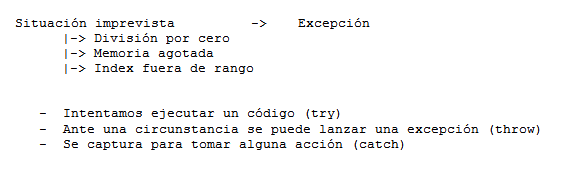
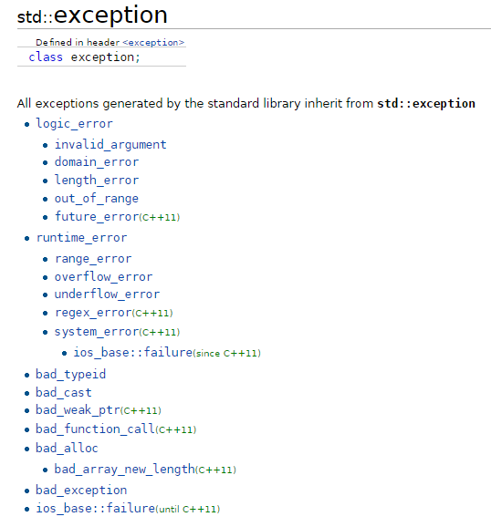

.. -*- coding: utf-8 -*-

.. _rcs_subversion:

Clase 16 - PGE 2017 (Clase no preparada aún)
===================
(Fecha: 11 de octubre)

Uso de atributos estáticos
^^^^^^^^^^^^^^^^^^^^^^^^^^

.. code-block:: c++

	// Archivo archivador.h
	#ifndef ARCHIVADOR_H
	#define ARCHIVADOR_H

	#include <QFile>
	#include <QTextStream>

	class Archivador  {
	private:
		static QFile *file;

	public:
		static bool abrir(QString ruta);
		static bool almacenar(QString texto);
	};
	
	#endif // ARCHIVADOR_H

	
.. code-block:: c++

	// Archivo archivador.cpp
	#include "archivador.h"

	QFile * Archivador::file = new QFile("./defecto.txt");

	bool Archivador::abrir(QString ruta)  {
		file->setFileName(ruta);

		if (!file->exists())  {
			return false;
		}

		return file->open(QIODevice::Append | QIODevice::Text);
	}

	bool Archivador::almacenar(QString texto)  {
		if (!file->isOpen())
			return false;

		QTextStream salida(file);
		salida << texto;

		return true;
	}

Ejercicio 23:
============

.. figure:: images/clase13/logger.png

Texturas
========

- Con la texturización agregamos una imagen a un polígono.
- En lugar de ver un color plano o color en degredé, veremos una imagen proyectada.

**Cargando texturas en memoria**

- Las dimensiones de las texturas tienen que ser potencias de 2 (64x64, 128x64, etc.).
- Tendremos un puntero a un segmento de memoria que contiene la imagen:

.. code-block:: c++

	unsigned char *textura;

	QImage im;
	if (!im.load(":/recursos/pared.bmp"))
	    QMessageBox::critical(this, "Recurso no disponible", "No pudo ser cargada.");

	im = QGLWidget::convertToGLFormat( im );
	textura = im.bits();

**Pasando las texturas a OpenGL**

- Cuando le pasamos la textura a OpenGL, éste nos devolverá un identificador.
- Cada textura tendrá un identificador propio.
- Cómo obtenemos ese identificador? Creamos una variable para almacenarlo:

.. code-block:: c++

	GLuint idTextura;

- Llamamos a ``glGenTextures(...)`` pasando la cantidad de texturas que queremos generar y un array donde queremos almacenar los identificadores. 
- En este caso, sólo queremos una textura, y por lo tanto no hace falta pasarle un array, sino un puntero a una variable de tipo GLuint.

.. code-block:: c++

	glGenTextures(1, &idTextura);  // este ultimo parámetro es GLuint *textures

- OpenGL pondrá en ``idTextura`` el valor del identificador. 
- Con ``glBindTexture(...)`` asignamos el valor de idTextura, a una textura de destino. 
- Es decir, activamos la textura asignada a idTextura, y todas las propiedades que modifiquemos, serán modificaciones de esa textura.

.. code-block:: c++

	glBindTexture(GL_TEXTURE_2D, idTextura);

- Ahora lo más importante, pasarle la textura a OpenGL. Con ``glTexImage2D(...)``.

.. code-block:: c++

	glTexImage2D(GL_TEXTURE_2D, 0, 3, anchoTextura, altoTextura, 0, GL_RGB, GL_UNSIGNED_BYTE, textura);

donde:

.. code-block:: c++

	void glTexImage2D(
	    GLenum tipoTextura,  // Ahora es GL_TEXTURE_2D
	    GLint nivelMipMap,  // Nivel de MipMapping. Por ahora ponemos 0
	    GLint formatoInterno,  // Nro de componentes de colorde textura. Si es RGB entonces es 3
	    GLsizei ancho,  // Ancho de la textura. Recordar que es potencia de 2
	    GLsizei alto,  // Alto de la textura. Recordar que es potencia de 2
	    GLint borde,  // Anchura del borde. Debe ser 0
	    GLenum formato,  // Formato de la textura en memoria. Usamos GL_RGBA
	    GLenum tipo,  // Tipo de variable con que almacenamos la textura. Si la 
	                  // almacenamos en unsigned char entonces GL_UNSIGNED_BYTE
	    const GLvoid *pixels  // El puntero a la región de memoria donde se almacena
	);

**Visualización de una textura**

- Texel es la unidad mínima de textura
- Si la textura es de 64 x 64 píxeles y la mostramos completa en una 1024x768.
- OpenGL escalará estos píxeles, de manera que cada píxel de la textura (de ahora en adelante téxel) ocupará 16x12 píxeles en la pantalla.

.. code-block:: c++

	1024 píxeles de ancho / 64 téxeles de ancho = 16;
	768 píxeles de alto / 64 téxeles de alto = 12;

- Lo que veremos serán "cuadrados" de 16x12.
- Poco realista ver una textura *pixelizada*.
- Podemos aplicar filtros.
- El más común es el *filtro lineal*, que hace una interpolación.

.. code-block:: c++

	glTexParameteri(GL_TEXTURE_2D, GL_TEXTURE_MAG_FILTER, GL_LINEAR);
	glTexParameteri(GL_TEXTURE_2D, GL_TEXTURE_MIN_FILTER, GL_LINEAR);

- Con esto estamos parametrizando dos filtros. 
- Uno para cuando la textura se representa más grande de lo que es en realidad.
- Y otro para cuando la textura es más pequeña.
- Le decimos que haga un filtro lineal. 
- También podríamos decirle que no aplique ningún filtro ``(GL_NEAREST)``.

**Renderizando con texturas**

- Ya teniendo las texturas cargadas y ajustadas, dibujamos polígonos con texturas.
- Supongamos dibujar un simple cuadrado con la textura cargada.
- Si lo dibujamos sin textura seria:

.. code-block:: c++

	glBegin (GL_QUADS);
	    glVertex3i (-100, -100, -5);
	    glVertex3i (-100, 100, -5);
	    glVertex3i (100, 100, -5);
	    glVertex3i (100, -100, -5);
	glEnd ();

- Aplicando textura sería:

.. code-block:: c++
	glEnable(GL_TEXTURE_2D);	// Activamos la texturización
	glBindTexture(GL_TEXTURE_2D, idTextura);	// Activamos la textura con idTextura

	glBegin (GL_QUADS);
	    glTexCoord2f(0.0f, 0.0f);    glVertex3i (-100, -100, -5);
	    glTexCoord2f(1.0f, 0.0f);    glVertex3i (-100, 100, -5);
	    glTexCoord2f(1.0f, 1.0f);    glVertex3i (100, 100, -5);
	    glTexCoord2f(0.0f, 1.0f);    glVertex3i (100, -100, -5);
	glEnd ();

	glDisable(GL_TEXTURE_2D);  // Desactivamos la textura. Para que no intente
	                           // texturizar algo que dibujemos después.

- Con la función ``glTexCoord2f(0.0f, 0.0f)`` tenemos: Las coordenadas de textura. 

**Ejemplo:**

.. code-block:: c++
	
	// archivo ogl.h
	#ifndef OGL_H
	#define OGL_H

	#include <QGLWidget>

	class QTimer;

	class Ogl : public QGLWidget  {
	    Q_OBJECT

	public:
	    Ogl();
	    void setTimer(int timerIntervalo);

	protected:
	    virtual void initializeGL() = 0;
	    virtual void resizeGL(int width, int height) = 0;
	    virtual void paintGL() = 0;

	    virtual void keyPressEvent(QKeyEvent *e);

	    virtual void timeout();

	protected slots:
	    virtual void slot_timeout();

	private:
	    QTimer *timer;

	};

	#endif // OGL_H

.. code-block:: c++

	// Archivo ogl.cpp
	#include "ogl.h"

	#include <QTimer>
	#include <QKeyEvent>
	#include <QDebug>

	Ogl::Ogl()  {
	}

	void Ogl::setTimer(int timerIntervalo)  {
	    if(timerIntervalo > 0)  {
	        timerIntervalo = qMin(15, timerIntervalo);
	        timer = new QTimer(this);
	        connect(timer, SIGNAL(timeout()), this, SLOT(slot_timeout()));
	        timer->start(timerIntervalo);
	    }
	}

	void Ogl::keyPressEvent(QKeyEvent *e)  {
	    switch( e->key() )  {
	    case Qt::Key_Escape:
	        close();
	    }
	}

	void Ogl::slot_timeout()  {
	    this->timeout();
	}

	void Ogl::timeout()  {
	}

.. code-block:: c++

	// Archivo visual.h
	#include "ogl.h"
	
	class Visual : public Ogl  {
	    Q_OBJECT
	public:
	    Visual();
	protected:
	    void initializeGL();
	    void resizeGL(int ancho, int alto);
	    void paintGL();
	    void timeout();
	private:
	    void cargarTexturas();
	    unsigned char *textura;
	    GLuint idTextura;
	};
 
.. code-block:: c++

	// Archivo visual.cpp
	#include <GL/glu.h>

	Visual::Visual() : Ogl()  {
	}

	void Visual::initializeGL()  {
	    this->cargarTexturas();
	    glEnable(GL_TEXTURE_2D);
	    glShadeModel(GL_SMOOTH);
	    glClearColor(0.0f, 0.0f, 0.0f, 0.0f);
	    glClearDepth(1.0f);
	    glEnable(GL_DEPTH_TEST);
	}

	void Visual::resizeGL(int ancho, int alto)  {
	    glViewport( 0, 0, (GLint)ancho, (GLint)alto );
	    glMatrixMode(GL_PROJECTION);
	    glLoadIdentity();
	    gluPerspective(45.0f, (GLfloat)ancho/(GLfloat)alto, 1, 100.0f);
	    glMatrixMode(GL_MODELVIEW);
	    glLoadIdentity();
	}

	void Visual::paintGL()  {
	    glClear(GL_COLOR_BUFFER_BIT | GL_DEPTH_BUFFER_BIT);
	    glLoadIdentity();
	    glEnable(GL_TEXTURE_2D);  // Activamos la texturización
	    glBindTexture(GL_TEXTURE_2D, idTextura);  // Activamos la textura con idTextura

	    glBegin(GL_QUADS);
	        glTexCoord2f(0.0f, 0.0f);  glVertex3f(-2.0f, -2.0f,  -8);
	        glTexCoord2f(2.0f, 0.0f);  glVertex3f( 2.0f, -2.0f,  -8);
	        glTexCoord2f(2.0f, 1.0f);  glVertex3f( 2.0f,  2.0f,  -8);
	        glTexCoord2f(0.0f, 1.0f);  glVertex3f(-2.0f,  2.0f,  -8);
	    glEnd();
	    glDisable(GL_TEXTURE_2D);
	    glFlush();
	}

	void Visual::timeout()  {
	    this->updateGL();
	}

	void Visual::cargarTexturas()   {
	    QImage im;
	    if (!im.load(":/recursos/pared.bmp"))
	        QMessageBox::critical(this, "Recurso no disponible", "La imagen no pudo ser cargada.");
	    im = QGLWidget::convertToGLFormat( im );
	    textura = im.bits();

	    glGenTextures(1, &idTextura);  // Generamos 1 textura. Guardamos su id en idTextura.
	    glBindTexture(GL_TEXTURE_2D, idTextura);  // Activamos idTextura.    
	    glTexParameteri(GL_TEXTURE_2D, GL_TEXTURE_MAG_FILTER, GL_LINEAR); // GL_LINEAR - Interpolacion
	    glTexParameteri(GL_TEXTURE_2D, GL_TEXTURE_MIN_FILTER, GL_LINEAR); // GL_NEAREST - Sin 

	    glTexParameteri(GL_TEXTURE_2D, GL_TEXTURE_WRAP_S, GL_REPEAT);  // GL_CLAMP -    
	    glTexParameteri(GL_TEXTURE_2D, GL_TEXTURE_WRAP_T, GL_REPEAT);  // GL_REPEAT - Permite repetir
	    glTexImage2D(GL_TEXTURE_2D, 0, 3, im.width(), im.height(), 0, GL_RGBA, GL_UNSIGNED_BYTE, textura);
	}

- `Descargar el código fuente <https://github.com/cosimani/Curso-PGE-2017/blob/master/sources/clase14/EjemploTexturas.zip?raw=true>`_

Ejercicio 24:
============

- Caminando en la habitación.
- Buscar una imagen de piso de cerámica para texturizar un plano horizontal.
- Con las teclas UP y DOWN realizar el efecto como si estuviéramos desplazándonos sobre la habitación hacia delante y atrás.
- Colocar una pared al fondo de la habitación con textura de ladrillos.

Ejercicio 25:
============

- En un nuevo proyecto promocionar en QtDesigner dos Escenas.
- Como si estuviéramos haciendo un App para la CardBoard.
- Intentar hacer ese pequeño desplazamiento de la imagen para cada ojo.

 

**typeid**

.. figure:: images/clase09/typeid.png

**Clase type_info**

- Dispone de un método para preguntar si es puntero y otro método para saber si es puntero a función:
		    
.. code-block::
			
	virtual bool __is_pointer_p() const;
   
	virtual bool __is_function_p() const;

.. figure:: images/clase09/type_info.png

Ejercicio 26:
============

.. figure:: images/clase09/ejercicio1.png

Ejercicio 27:
============

.. figure:: images/clase09/ejercicio2.png

Tratamiento de excepciones
^^^^^^^^^^^^^^^^^^^^^^^^^^

* `Explicación por un youtuber <http://www.youtube.com/watch?v=wcuknro_V-w>`_

**Excepciones de la biblioteca estándar de C++**

**Ejemplo creando nuestras propias clases para excepciones**

.. code-block:: c++

	#ifndef EXCEPCIONES_H
	#define EXCEPCIONES_H

	#include <QString>
	#include <QFile>

	class ExcRango  {
	private:
	    QString mensaje;
	public:
	    ExcRango(QString mensaje, int i) : mensaje(mensaje)  {   }
	    QString getMensaje()  {  return mensaje;  }
	};

	class ExcNoArchivo  {
	private:
	    QString archivo;
	    QString mensaje;

	public:
	    ExcNoArchivo(QString archivo) : archivo(archivo)  {
	        QFile file(archivo);
	        if (!file.exists())
	            mensaje.operator=("El archivo " + archivo + " no existe.");
	    }

	    QString getMensaje()  {  return mensaje;  }
	};

	#endif // EXCEPCIONES_H

.. code-block:: c++

	#ifndef ARCHIVADOR_H
	#define ARCHIVADOR_H

	#include <QFile>
	#include <QTextStream>
	#include "excepciones.h"

	class Archivador  {
	private:
	    static QFile *file;

	public:
	    static bool abrir(QString ruta)  {
	        file->setFileName(ruta);

	        if (!file->exists())  {
	            throw ExcNoArchivo(ruta);
	            return false;
	        }

	        return file->open(QIODevice::Append | QIODevice::Text);
	    } 

	    static bool almacenar(QString texto)  {
	        if (!file->isOpen())
	        return false;

	        QTextStream salida(file);
	        salida << texto;
 
	        return true;
	    }
	};

	QFile * Archivador::file = new QFile("./defecto.txt");

	#endif // ARCHIVADOR_H

.. code-block:: c++

	#include <QApplication>
	#include "archivador.h"
	#include <QDebug>

	int main(int argc, char** argv)  {
	    QApplication a(argc, argv);

	    try  {
	        Archivador::abrir("./defecto.txt");
	        Archivador::almacenar("11111111");
	    }
	    catch(ExcNoArchivo e)  {
	        qDebug() << e.getMensaje();
	    }

	    return 0;
	}
	
Ejercicio 28:
============

- Modificar la clase listado para que cuando sea necesario lance la excepción ExcRango cuando se intente acceder a un index fuera de rango. Probarlo luego en la función main.

.. code-block:: c++

	template <class T> class Listado  {
	private:
	    int cantidad;
	    int libre;
	    T *v;

	public:
	    Listado(int n=10) : cantidad(n), libre(0), v(new T[n])  {  }
	    bool add(T nuevo);

	    T get(int i)  {
	        if (i>=libre)
	            throw ExcRango("Listado fuera de rango", i);
	        return v[i];
	    }

	    int length()  {  return libre;  }
	};

	template <class T> bool Listado<T>::add(T nuevo)  {
	    if (libre < cantidad)  {
	        v[libre] = nuevo;
	        libre++;
	        return true;
	    }
	    return false;
	}

**Resolución. Sin typeid.**

.. code-block:: c++

	#ifndef PERSONA_H
	#define PERSONA_H

	#include <QString>

	class Persona  {
	public:
	    Persona() : dni( 0 )  {  }
	    virtual ~Persona()  {  }

	private:
	    int dni;
	};

	class Cliente : public Persona  {
	public:
	    Cliente() : cuenta( 0 ), tipo( "Corriente" )  {  }

	private:
	    int cuenta;
	    QString tipo;
	};

	class Empleado : public Persona  {
	public:
	    Empleado() : sueldo( 0 )  {  }

	private:
	    int sueldo;
	};

	#endif // PERSONA_H

.. code-block:: c++

	#ifndef PRINCIPAL_H
	#define PRINCIPAL_H

	#include <QWidget>
	#include <QVector>
	#include "persona.h"

	namespace Ui {
	    class Principal;
	}

	class Principal : public QWidget
	{
	Q_OBJECT

	public:
	    explicit Principal( QWidget *parent = 0 );
	    ~Principal();

	private:
	    Ui::Principal *ui;
	    QVector< Persona * > vector;

	private slots:
	    void slot_agregar();
	};

	#endif // PRINCIPAL_H

.. code-block:: c++

	#include "principal.h"
	#include "ui_principal.h"
	#include <QDebug>

	Principal::Principal(QWidget *parent) : QWidget( parent ),
	                                        ui( new Ui::Principal )  {
	    ui->setupUi( this );

	    connect( ui->pbCliente, SIGNAL( pressed() ), this, SLOT( slot_agregar() ) );
	    connect( ui->pbEmpleado, SIGNAL( pressed() ), this, SLOT( slot_agregar() ) );
	}

	Principal::~Principal()  {
	    delete ui;
	}

	void Principal::slot_agregar()  {

	    if ( this->sender() == ui->pbCliente )  {
	        if (vector.isEmpty())  {
	            vector.push_back( new Cliente );
	            qDebug() << "Se agrega como primer elemento un Cliente";
	        }
	        else  {
	            Cliente * pd = dynamic_cast<Cliente*>( vector.at( 0 ) );

	            if ( pd != 0 )  {
	                vector.push_back( new Cliente );
	                qDebug() << "Se agrega otro Cliente. El Cliente numero" << vector.size();
	            }
	            else  {
	                qDebug() << "Este QVector no contiene Clientes. No se agrega nada.";
	            }
	        }
	    }
	    else  {
	        if (vector.isEmpty())  {
	            vector.push_back( new Empleado );
	            qDebug() << "Se agrega como primer elemento un Empleado";
	        }
	        else  {
	            Empleado * pd = dynamic_cast<Empleado*>( vector.at( 0 ) );

	            if ( pd != 0 )  {
	                vector.push_back( new Empleado );
	                qDebug() << "Se agrega otro Cliente. El Empleado numero" << vector.size();
	            }
	            else  {
	                qDebug() << "Este QVector no contiene Empleados. No se agrega nada.";
	            }
	        }
	    }
	}

**Ejercicio**

- Hacer lo mismo pero usando typeid.

**Clase QThread**

- Permite crear hilos de ejecución para realizar varias tareas a la vez. 
- Proporciona el método start() para iniciar el hilo.
- Emite señales para indicar el inicio y fin de la ejecución del hilo.
- Se necesita reimplementar el método run() en una clase derivada de QThread.
- El código dentro de run() se ejecuta en un hilo y finaliza cuando retorna.
- La programación miltihilo es un paradigma útil para realizar tareas que consumen tiempo sin congelar la interfaz de usuario.

.. code-block:: c++

	class MiHilo : public QThread  {
	    Q_OBJECT

	protected:
	    void run();
	};

	void MiHIlo::run()  {

	    ...

	}

	
- Las clases no GUI (QTimer, QTcpSocket, QFtp, etc.) fueron diseñadas para funcionar en un hilo independiente.
- Las clases GUI (QWidget y derivadas) sólo se puede usar desde el hilo principal.
- Para consultar el estado del hilo podemos utilizar isFinished() o isRunning().
- Podríamos terminar un hilo a fuerza bruta con terminate().
- Dormimos el hilo con: sleep(int seg) o msleep(int miliseg) o usleep(int microseg)

Ejercicio 29:
============
	
- Diseñar una aplicación GUI que escriba en un archivo muchísimos caracteres de tal forma se note que la interfaz de usuario se bloquea hasta finalizar la escritura.
- Luego de esto, utilizar un hilo distinto para escribir la misma cantidad de caracteres.

Ejercicio 30:
============

.. figure:: images/clase16/ejer-medidor.jpg
