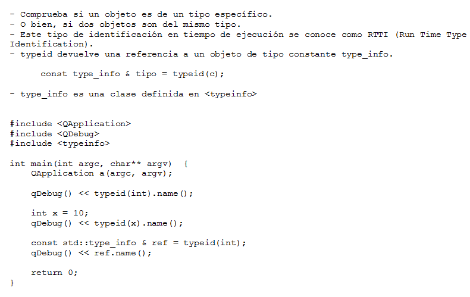

.. -*- coding: utf-8 -*-

.. _rcs_subversion:

Clase 18 - PGE 2017 (Clase no preparada aún)
===================
(Fecha: 25 de octubre)

**typeid**

**Clase type_info**

- Dispone de un método para preguntar si es puntero y otro método para saber si es puntero a función:
		    
.. code-block::
			
	virtual bool __is_pointer_p() const;
   
	virtual bool __is_function_p() const;

.. figure:: images/clase09/type_info.png

Ejercicio 27:
============

.. figure:: images/clase09/ejercicio1.png

Ejercicio 28:
============

.. figure:: images/clase09/ejercicio2.png

Tratamiento de excepciones
^^^^^^^^^^^^^^^^^^^^^^^^^^

.. figure:: images/clase15/excepciones1.png

* `Explicación por un youtuber <http://www.youtube.com/watch?v=wcuknro_V-w>`_

**Excepciones de la biblioteca estándar de C++**

.. figure:: images/clase15/excepciones2.png

**Ejemplo creando nuestras propias clases para excepciones**

.. code-block:: c++

	#ifndef EXCEPCIONES_H
	#define EXCEPCIONES_H

	#include <QString>
	#include <QFile>

	class ExcRango  {
	private:
	    QString mensaje;
	public:
	    ExcRango(QString mensaje, int i) : mensaje(mensaje)  {   }
	    QString getMensaje()  {  return mensaje;  }
	};

	class ExcNoArchivo  {
	private:
	    QString archivo;
	    QString mensaje;

	public:
	    ExcNoArchivo(QString archivo) : archivo(archivo)  {
	        QFile file(archivo);
	        if (!file.exists())
	            mensaje.operator=("El archivo " + archivo + " no existe.");
	    }

	    QString getMensaje()  {  return mensaje;  }
	};

	#endif // EXCEPCIONES_H

.. code-block:: c++

	#ifndef ARCHIVADOR_H
	#define ARCHIVADOR_H

	#include <QFile>
	#include <QTextStream>
	#include "excepciones.h"

	class Archivador  {
	private:
	    static QFile *file;

	public:
	    static bool abrir(QString ruta)  {
	        file->setFileName(ruta);

	        if (!file->exists())  {
	            throw ExcNoArchivo(ruta);
	            return false;
	        }

	        return file->open(QIODevice::Append | QIODevice::Text);
	    } 

	    static bool almacenar(QString texto)  {
	        if (!file->isOpen())
	        return false;

	        QTextStream salida(file);
	        salida << texto;
 
	        return true;
	    }
	};

	QFile * Archivador::file = new QFile("./defecto.txt");

	#endif // ARCHIVADOR_H

.. code-block:: c++

	#include <QApplication>
	#include "archivador.h"
	#include <QDebug>

	int main(int argc, char** argv)  {
	    QApplication a(argc, argv);

	    try  {
	        Archivador::abrir("./defecto.txt");
	        Archivador::almacenar("11111111");
	    }
	    catch(ExcNoArchivo e)  {
	        qDebug() << e.getMensaje();
	    }

	    return 0;
	}
	
Ejercicio 29:
============

- Modificar la clase listado para que cuando sea necesario lance la excepción ExcRango cuando se intente acceder a un index fuera de rango. Probarlo luego en la función main.

.. code-block:: c++

	template <class T> class Listado  {
	private:
	    int cantidad;
	    int libre;
	    T *v;

	public:
	    Listado(int n=10) : cantidad(n), libre(0), v(new T[n])  {  }
	    bool add(T nuevo);

	    T get(int i)  {
	        if (i>=libre)
	            throw ExcRango("Listado fuera de rango", i);
	        return v[i];
	    }

	    int length()  {  return libre;  }
	};

	template <class T> bool Listado<T>::add(T nuevo)  {
	    if (libre < cantidad)  {
	        v[libre] = nuevo;
	        libre++;
	        return true;
	    }
	    return false;
	}

**Resolución. Sin typeid.**

.. code-block:: c++

	#ifndef PERSONA_H
	#define PERSONA_H

	#include <QString>

	class Persona  {
	public:
	    Persona() : dni( 0 )  {  }
	    virtual ~Persona()  {  }

	private:
	    int dni;
	};

	class Cliente : public Persona  {
	public:
	    Cliente() : cuenta( 0 ), tipo( "Corriente" )  {  }

	private:
	    int cuenta;
	    QString tipo;
	};

	class Empleado : public Persona  {
	public:
	    Empleado() : sueldo( 0 )  {  }

	private:
	    int sueldo;
	};

	#endif // PERSONA_H

.. code-block:: c++

	#ifndef PRINCIPAL_H
	#define PRINCIPAL_H

	#include <QWidget>
	#include <QVector>
	#include "persona.h"

	namespace Ui {
	    class Principal;
	}

	class Principal : public QWidget
	{
	Q_OBJECT

	public:
	    explicit Principal( QWidget *parent = 0 );
	    ~Principal();

	private:
	    Ui::Principal *ui;
	    QVector< Persona * > vector;

	private slots:
	    void slot_agregar();
	};

	#endif // PRINCIPAL_H

.. code-block:: c++

	#include "principal.h"
	#include "ui_principal.h"
	#include <QDebug>

	Principal::Principal(QWidget *parent) : QWidget( parent ),
	                                        ui( new Ui::Principal )  {
	    ui->setupUi( this );

	    connect( ui->pbCliente, SIGNAL( pressed() ), this, SLOT( slot_agregar() ) );
	    connect( ui->pbEmpleado, SIGNAL( pressed() ), this, SLOT( slot_agregar() ) );
	}

	Principal::~Principal()  {
	    delete ui;
	}

	void Principal::slot_agregar()  {

	    if ( this->sender() == ui->pbCliente )  {
	        if (vector.isEmpty())  {
	            vector.push_back( new Cliente );
	            qDebug() << "Se agrega como primer elemento un Cliente";
	        }
	        else  {
	            Cliente * pd = dynamic_cast<Cliente*>( vector.at( 0 ) );

	            if ( pd != 0 )  {
	                vector.push_back( new Cliente );
	                qDebug() << "Se agrega otro Cliente. El Cliente numero" << vector.size();
	            }
	            else  {
	                qDebug() << "Este QVector no contiene Clientes. No se agrega nada.";
	            }
	        }
	    }
	    else  {
	        if (vector.isEmpty())  {
	            vector.push_back( new Empleado );
	            qDebug() << "Se agrega como primer elemento un Empleado";
	        }
	        else  {
	            Empleado * pd = dynamic_cast<Empleado*>( vector.at( 0 ) );

	            if ( pd != 0 )  {
	                vector.push_back( new Empleado );
	                qDebug() << "Se agrega otro Cliente. El Empleado numero" << vector.size();
	            }
	            else  {
	                qDebug() << "Este QVector no contiene Empleados. No se agrega nada.";
	            }
	        }
	    }
	}

**Ejercicio**

- Hacer lo mismo pero usando typeid.

**Clase QThread**

- Permite crear hilos de ejecución para realizar varias tareas a la vez. 
- Proporciona el método start() para iniciar el hilo.
- Emite señales para indicar el inicio y fin de la ejecución del hilo.
- Se necesita reimplementar el método run() en una clase derivada de QThread.
- El código dentro de run() se ejecuta en un hilo y finaliza cuando retorna.
- La programación miltihilo es un paradigma útil para realizar tareas que consumen tiempo sin congelar la interfaz de usuario.

.. code-block:: c++

	class MiHilo : public QThread  {
	    Q_OBJECT

	protected:
	    void run();
	};

	void MiHIlo::run()  {

	    ...

	}

	
- Las clases no GUI (QTimer, QTcpSocket, QFtp, etc.) fueron diseñadas para funcionar en un hilo independiente.
- Las clases GUI (QWidget y derivadas) sólo se puede usar desde el hilo principal.
- Para consultar el estado del hilo podemos utilizar isFinished() o isRunning().
- Podríamos terminar un hilo a fuerza bruta con terminate().
- Dormimos el hilo con: sleep(int seg) o msleep(int miliseg) o usleep(int microseg)

Ejercicio 30:
============
	
- Diseñar una aplicación GUI que escriba en un archivo muchísimos caracteres de tal forma se note que la interfaz de usuario se bloquea hasta finalizar la escritura.
- Luego de esto, utilizar un hilo distinto para escribir la misma cantidad de caracteres.

Ejercicio 31:
============

.. figure:: images/clase16/ejer-medidor.jpg

Función callback
^^^^^^^^^^^^^^^^

- Función que se llama a través de un puntero a función.
- Se puede utilizar como parámetro de otra función.
- Cuando la función que recibe este puntero a función hace uso de este, se dice que hace una retrollamada (callback).
- Si en la clase Listado deseamos que se ordenen los datos pero no queremos incluir (en Listado) la lógica de un método de ordenamiento, podemos pedir al programador que nos pase como parámetro un puntero a su propia función de ordenamiento.
- Se podría utilizar para una simple notificación o comunicación de dos vías (similar a las signals y slots).
- Cuando un diseñador de bibliotecas quiere notificar al programador sobre algún suceso, puede solicitar un puntero a función.

**Declaraciones de punteros a funciones:**

.. code-block:: c++

	void (*fptr)();  
	// puntero a una función sin parámetros que devuelve void.

	void (*fptr)(int);	
	// puntero a función que recibe int y devuelve void.

	int (*fptr)(int, char);		
	// acepta int y char y devuelve un int.

	int * (*fptr)();	
	// puntero a función, sin argumentos y devuelve puntero a int

**Declaraciones de punteros a funciones (o métodos) de clases:**

.. code-block:: c++

	void (C::*puntero) (int);  // puntero a método de la clase C

	int (C::*puntero) ();

- Antes de usar un puntero a función es necesario definirlo (asignarle un valor).
- El valor es la dirección de memoria donde inicia una función concreta.

.. code-block:: c++

	char funcion(int);  // Declara una función concreta

	char (*puntero_funcion) (int);  // Declara un puntero a función

	puntero_funcion = &funcion;  // Asigna al puntero la dirección de memoria de funcion(int)

**Luego de declarado y definido, podemos usarlo de dos formas:**

- Acceder (invocar), a la función que representa
- Usarlo como parámetro de otra función.

**Invocación**

.. code-block:: c++

	char funcion(int);  // Declara función concreta. Suponemos que está definida en otro lugar.

	char (*puntero_funcion)(int);  // Declaramos puntero a función

	puntero_funcion = &funcion;  // Asigna la dirección de memoria

	int i = 10;
	char c;

	c = (*puntero_funcion)(i);

**Ejemplo**

.. code-block:: c++

	#include <iostream>

	void funcion() {  std::cout << "Una funcion cualquiera" << std::endl; }
	void (*puntero_funcion)() = &funcion; 

	int main ()  {      
	    funcion();     
	    (*puntero_funcion)(); 
	    puntero_funcion();   

	    return 0;
	}

	// Salida:
	// Una funcion cualquiera
	// Una funcion cualquiera
	// Una funcion cualquiera

**Paso de funciones como argumento**

.. code-block:: c++

	void funcion(void (*puntero_funcion)() ) {  
	    // Código de este método

	    (*puntero_funcion)();  // Llama a la función apuntada
	}

Ejercicio 32:
============

- Definir la siguiente clase:

.. code-block:: c++

	class Ordenador  {
	public:
	    void burbuja(int * v, int n)  {  /* código */  }
	    void insercion(int * v, int n)  {  /* código */  }

	    void seleccion(int * v, int n)  {  /* código */  }
	};

- Esta clase tendrá distintos métodos de ordenamiento.
- Cada método ordena un array de n cantidad de enteros
- Definir la clase ListaDeEnteros
	- Herede de QVector
	- Que no sea un template
	- Que sólo mantenga elementos del tipo int
	- Definir un método:
	
.. code-block:: c++	
		
	void ordenar(Ordenador::*puntero_funcion)(int * v, int n))
	// Este método ordenará los elementos

**Array de punteros a función**

- Los punteros a funciones se pueden agruparse en arreglos

.. code-block:: c++	

	int (* afptr[10])(int);    // array de 10 punteros a función

- Los 10 punteros apuntan a funciones con el mismo prototipo
- Permiten muchas variantes para invocar funciones

.. code-block:: c++	

	int a = afptr[n](x);
	
Ejercicio 33:
============

- Con la misma idea del ejercicio anterior. Crear la clase genérica ListadoGenerico que herede de QVector<T>
- La clase ListaGenerico tendrá el siguiente método:
	
.. code-block:: c++	
		
	void ordenar(Ordenador::*puntero_funcion)(T * v, int n))
	// Este método ordenará los elementos
	
- Notar que ordenar podrá ordenar elementos de cualquier tipo, siempre y cuando los objetos a ordenar sean de una clase que tenga sobrecargado el operador >
	

Ejercicio 34:
============

- Modificar el ejercicio de la clase ListadoEnteros para usar funciones globales de ordenamiento, es decir, que no se encuentren dentro de Ordenador ni de ninguna clase.

.. code-block:: c++	

	class ListadoEnteros : public QVector<int>  {
	public:
	    void ordenar(void (*pFuncionOrdenamiento)(int *, int))  {
	        (*pFuncionOrdenamiento)(this->data(), this->size());
	    }
	};

.. code-block:: c++		
	///// Desde main se puede utilizar así:

    void (*ordenador)(int *, int) = &burbuja;

    listado.ordenar(ordenador);

Ejercicio 35:
============

- Modificar el ejercicio anterior usando también funciones globales de ordenamiento pero con la clase ListadoGenerico que sea un template:

.. code-block:: c++	

	template<class T> class ListadoGenerico : public QVector<T>  {
	public:
	    void ordenar(void (*pFuncionOrdenamiento)(int *, int))  {
	        (*pFuncionOrdenamiento)(this->data(), this->size());
	    }
	};

Ejercicio 36:
============

- Necesitamos conocer el rendimiento de cada algoritmo de ordenamiento midiendo su tiempo.
- Utilizar un array de punteros a funciones que apunte a cada función global de ordenamiento.
- Utilizar Archivador para almacenar los tiempos en un archivo.
- Utilizar un ListadoEnteros de 50.000 números generados con qrand()

.. code-block:: c++		

	///// Desde main se puede utilizar así:

    void (*ordenador[2])(int *, int);
    ordenador[0] = &burbuja;
    ordenador[1] = &insercion;

    listado.ordenar(ordenador[1]);

**Otro ejemplo: Función callback**

.. code-block:: c++

	#ifndef BOTONES_H
	#define BOTONES_H

	class Boton{
	public:
	    virtual void click()  {  }
	};

	template <class T> class BotonCallBack : public Boton  {
	private:
	    T *destinatario;
	    void (T::*callback)(void);
	public:
	    BotonCallBack(T *otro, void (T::*puntero_funcion)(void))
	        : destinatario(otro), callback(puntero_funcion)  {  }
	
	    void click()  {
	        (destinatario->*callback)();
	    }
	};

	#endif // BOTONES_H

.. code-block:: c++

	#ifndef REPRODUCTOR_H
	#define REPRODUCTOR_H

	#include <QDebug>

	class MP3Player{
	public:
	    void play()  {
	        qDebug() << "Escuchando...";
	    }
	};

	#endif // REPRODUCTOR_H

.. code-block:: c++

	#include <QApplication>
	#include "botones.h"
	#include "reproductor.h"

	int main(int argc, char** argv)  {
	    QApplication a(argc, argv);

	    MP3Player mp3;
	    BotonCallBack<MP3Player> *boton;

	    //Conecta un MP3Player a un botón
	    boton = new BotonCallBack<MP3Player>(&mp3, &MP3Player::play);

	    boton->click();

	    return 0;
	}

