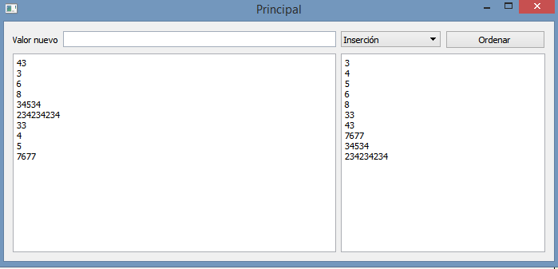

.. -*- coding: utf-8 -*-

.. _rcs_subversion:

Clase 22 - PGE 2018
===================
(Fecha: 8 de noviembre)

**Podemos ahora llevar las imágenes de la cámara como textura a OpenGL**

.. code-block:: c++

	class Visual : public Ogl  {
		Q_OBJECT
	public:
		Visual();
		void iniciarCamara();

	protected:
		void initializeGL();
		void resizeGL( int ancho, int alto );
		void paintGL();

	private:
		Capturador * capturador;
		QCamera * camera;

		void cargarTexturas();
		void cargarTexturaCamara();

		unsigned char *texturaCielo;
		unsigned char *texturaMuro;
		GLuint idTextura[ 2 ];

		unsigned char *texturaCamara;
		GLuint idTexturaCamara[ 1 ];
	};

	void Visual::iniciarCamara()  {
		capturador = new Capturador;

		QList<QCameraInfo> cameras = QCameraInfo::availableCameras();

		for (int i=0 ; i<cameras.size() ; i++)  {
			qDebug() << cameras.at(i).description();

			if (cameras.at(i).description().contains( "Truevision", Qt::CaseInsensitive ) )  {
				camera = new QCamera( cameras.at( i ) );
				camera->setViewfinder( capturador );
				camera->start(); // to start the viewfinder
			}
		}

		glGenTextures(1, idTexturaCamara);
	}

	void Visual::cargarTexturaCamara()  {

		QVideoFrame frameActual = capturador->getFrameActual();
		texturaCamara = frameActual.bits();

		glBindTexture( GL_TEXTURE_2D, idTexturaCamara[ 0 ] );  // Activamos idTextura.
		glTexParameteri( GL_TEXTURE_2D, GL_TEXTURE_MAG_FILTER, GL_LINEAR ); 
		glTexParameteri( GL_TEXTURE_2D, GL_TEXTURE_MIN_FILTER, GL_LINEAR ); 

		glTexImage2D( GL_TEXTURE_2D, 
		              0, 
		              3, 
		              frameActual.width(), 
		              frameActual.height(), 
		              0, 
		              GL_BGRA, 
		              GL_UNSIGNED_BYTE, 
		              texturaCamara );
	}

**Ejercicio:**

- Crear una escena con OpenGL con glOrtho para mostrar como textura las imágenes de la cámara en un QUADS.
- Luego probar con gluPerspective

**Resolución**

- Descargar `Código fuente <https://github.com/cosimani/Curso-PGE-2018/blob/master/sources/clase19/camaraOgl.zip?raw=true>`_

Ejercicio 38:
============

- Dentro de la habitación elegir una pared para colocar un monitor LCD con las imágenes de la cámara.

Ejercicio 39:
============

- En el ejercicio de la Habitación, mejorar los movimientos que se realizan con el mouse.
- Con la barra espaciadora se deberá saltar dentro de la escena.

**Resolución del Ejercicio con punteros a métodos de la clase Ordenador** 

.. code-block:: c++

	#ifndef ORDENADOR
	#define ORDENADOR

	class Ordenador  {
	public:
	    void burbuja(int * v, int n)  {
	        int i, j, aux;
	        for(i=0 ; i<=n ; i++)  {
	            for(j=0 ; j<n-1 ; j++)  {
	                if(v[j] > v[j+1])  {
	                    aux = v[j];
	                    v[j] = v[j+1];
	                    v[j+1] = aux;
	                }
	            }
	        }
	    }

	    void insercion(int * v, int n)  {
	        int i, j, aux;
	        for (i=1 ; i<n; i++)  {
	            aux = v[i];
	            j = i - 1;
	            while ( (v[j] > aux) && (j >= 0) )  {
	                v[j+1] = v[j];
	                j--;
	            }
	            v[j+1] = aux;
	        }
	    }
	};

	#endif // ORDENADOR
	
.. code-block:: c++

	#ifndef LISTADOENTEROS_H
	#define LISTADOENTEROS_H

	#include <QVector>
	#include "ordenador.h"

	class ListadoEnteros : public QVector<int>  {
	public:

	    void ordenar(void (Ordenador::*pFuncionOrdenamiento)(int *, int))  {
	        (ordenador.*pFuncionOrdenamiento)(this->data(), this->size());
	    }

	private:
	    Ordenador ordenador;
	};

	#endif // LISTADOENTEROS_H
	
.. code-block:: c++

	#ifndef PRINCIPAL_H
	#define PRINCIPAL_H

	#include <QWidget>
	#include "listadoEnteros.h"

	namespace Ui {
	    class Principal;
	}

	class Principal : public QWidget  {
	    Q_OBJECT

	public:
	    explicit Principal(QWidget *parent = 0);
	    ~Principal();

	private:
	    Ui::Principal *ui;
	    ListadoEnteros listado;

	private slots:
	    void slot_ordenar();
	    void slot_valorNuevo();
	};

	#endif // PRINCIPAL_H

.. code-block:: c++

	#include "principal.h"
	#include "ui_principal.h"

	Principal::Principal(QWidget *parent) : QWidget(parent), ui(new Ui::Principal)  {
	    ui->setupUi(this);

	    connect(ui->pbOrdenar, SIGNAL(clicked()), this, SLOT(slot_ordenar()));
	    connect(ui->leValorNuevo, SIGNAL(returnPressed()), this, SLOT(slot_valorNuevo()));
	}

	Principal::~Principal()  {  delete ui;  }

	void Principal::slot_ordenar()  {

	    if (ui->cbMetodo->currentText() == "Burbuja")  {
	        void (Ordenador::*burbuja)(int *, int) = &Ordenador::burbuja;
	        listado.ordenar(burbuja);
	    }
	    else  {
	        void (Ordenador::*insersion)(int *, int) = &Ordenador::insercion;
	        listado.ordenar(insersion);
	    }

	    for (int i=0 ; i<listado.size() ; i++)  {
	        ui->teOrdenados->append(QString::number(listado.at(i)));
	    }
	}

	void Principal::slot_valorNuevo()  {
	    listado.push_back(ui->leValorNuevo->text().toInt());

	    ui->teValores->append(ui->leValorNuevo->text());

	    ui->leValorNuevo->clear();
	}

Ejercicio 40:
============

- Seguimiento de objetos

- Se desea crear una aplicación que permita realizar el seguimiento de objetos según su color
- La GUI mostrará la cámara y permitirá hacer clic sobre un píxel y tomará los colores RGB
- A partir de esto, se realizará un seguimiento de este objeto. Dibujar un círculo o una marca cualquiera sobre este objeto.
- **Mejora 1:** Corregir el parpadeo que tiene la imagen
- **Mejora 2:** Corregir la orientación de la imagen
- **Mejora 3:** Trabajar con matices para identificar color. Usar el siguiente método:

.. code-block:: c++	

	int QColor::hue() const

**Ayuda para Ejercicio:** 

- `Descargar proyecto Seguimiento desde aquí <https://github.com/cosimani/Curso-PGE-2018/blob/master/sources/clase20/seguimiento.rar?raw=true>`_

- También puede usar el siguiente `Código fuente <https://github.com/cosimani/Curso-PGE-2018/blob/master/sources/clase19/camaraOgl.zip?raw=true>`_

- Dispone de la clase Capturador que tiene el siguiente método:

.. code-block:: c++	
	
	/**
	 * @brief Metodo que devuelve el cuadro actual.
	 * @return QVideoFrame que luego se puede convertir en QImage
	 */
	QVideoFrame getFrameActual()  {  return frameActual;  }

- Configurando un QTimer podríamos obtener el cuadro actual, procesarlo y publicarlo sobre algún QWidget que esté promocionado en QtDesigner
- Para encender la cámara necesitamos hacer:

.. code-block:: c++	

	Capturador * capturador = new Capturador;
	QCamera * camera;

	QList<QCameraInfo> listaCamaras = QCameraInfo::availableCameras();
	
	if ( ! listaCamaras.empty() )  {  // Si hay al menos una camara
	    camera = new QCamera(listaCamaras.at(0));  // Preparamos la primera camara disponible
	    camera->setViewfinder(capturador); 
	    camera->start();  // Encendemos la primera
	}

- Esto hace que se vayan levantando las imágenes de la cámara pero no se visualizarán en ningún lado. Esto trabaja distinto a QCameraViewfinder.
- Necesitamos entonces obtener este QVideoFrame, quizás convertirlo a QImage y dibujarlo sobre algún QWidget.
- Para convertir de QVideoFrame a QImage se puede hacer lo siguiente:

.. code-block:: c++	

	QVideoFrame frameActual = capturador->getFrameActual();

	QImage::Format imageFormat = QVideoFrame::imageFormatFromPixelFormat(frameActual.pixelFormat());

	QImage image( frameActual.bits(),
	              frameActual.width(),
	              frameActual.height(),
	              frameActual.bytesPerLine(),
	              imageFormat );

Ejercicio 41:
============

- Usar la técnica de Croma (https://es.wikipedia.org/wiki/Croma) para eliminar el fondo de las imágenes de la cámara
- Utilizar el mouse para elegir un pixel, el cual será tomado como el color que se eliminará.
- Colocar un botón que permita abrir el disco y elegir la imagen que será colocada como fondo.

Ejemplo de un proyecto para desplazarse dentro de una escena OpenGL
^^^^^^^^^^^^^^^^^^^^^^^^^^^^^^^^^^^^^^^^^^^^^^^^^^^^^^^^^^^^^^^^^^^

- Permite desplazarse con teclado y mouse dentro de la escena OpenGL
- `Descargar proyecto base desde aquí <https://github.com/cosimani/Curso-PGE-2018/blob/master/sources/clase21/DesplazamientoEnEscena.rar?raw=true>`_
- Notar lo siguiente:
	- Método para dibujar plano horizontal y vertical
	- Control del mouse para la rotación
	- Teclas para el desplazamiento hacia adelante y atrás
	- Forma de organizar las carpetas
- Tener en cuenta:
	- Se puede pedir mirar para arriba y abajo
	- Saltar
	- Desplazarse hacia laterales

Ejercicio 42:
============

- Dentro de la escena mostrar la cámara.
- Que permita pausar la cámara con la letra P.

Ejercicio 43:
============

- Pensar en la siguiente topología

.. figure:: images/clase21/topologia.png

- `Descargar el siguiente proyecto Qt <https://github.com/cosimani/Curso-PGE-2018/blob/master/resources/clase21/redes.rar?raw=true>`_
- En la clase Router definir un método que reciba como parámetro un puntero a función, por ejemplo:

.. code-block:: c++	

	void setTabla( QList<QStringList> (*puntero) () );
	
- El puntero apunta a una función global en el archivo de cabecera rutas.h donde existen varias funciones que generan distintas tablas de ruteo.
- Notar que cada router tiene su propia tabla de ruteo

Ejercicio 44:
============

- En el medio de la habitación dibujar un cubo girando
- Pegar la textura de la cámara en cada lado del cubo

